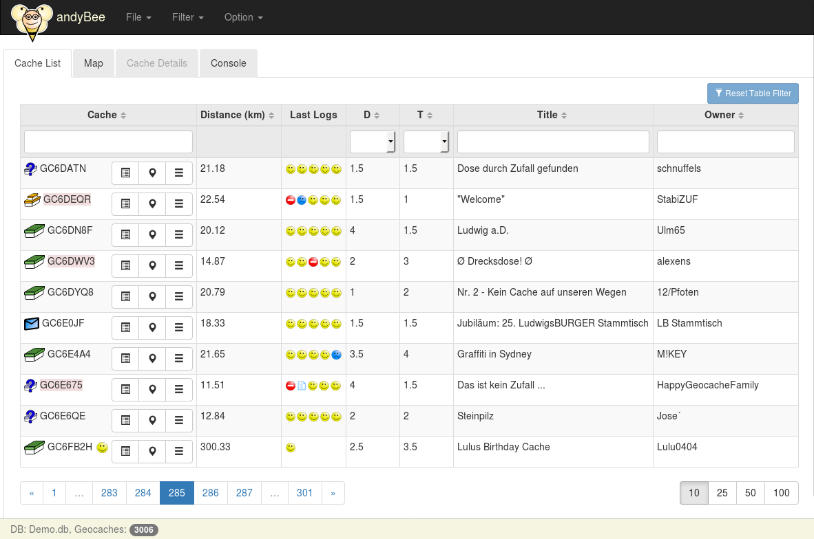
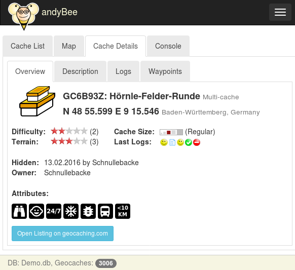
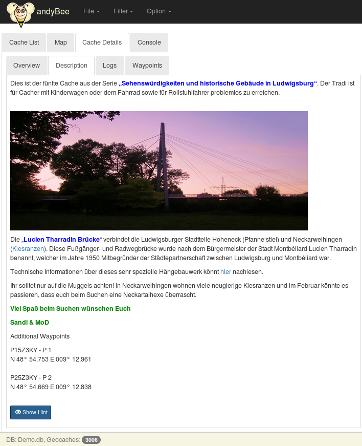
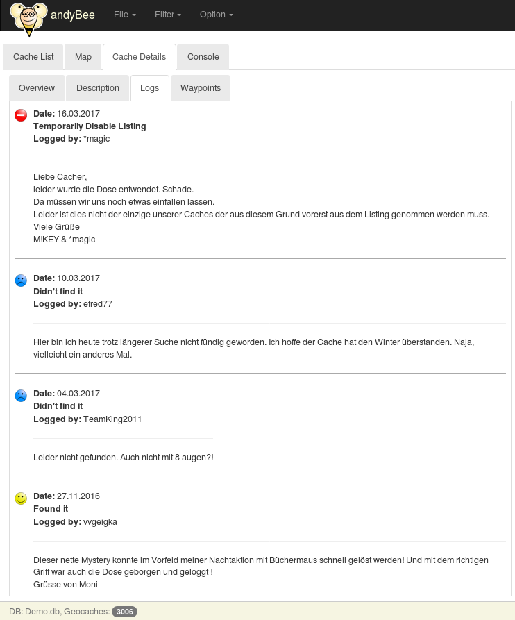
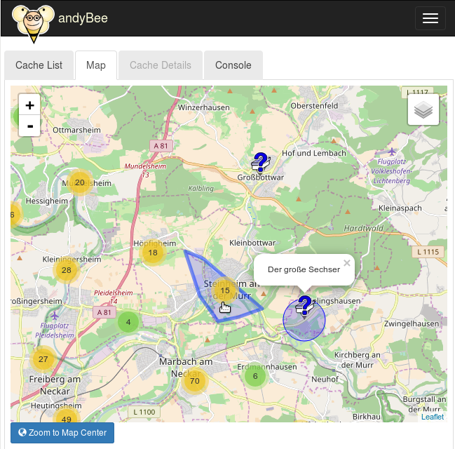
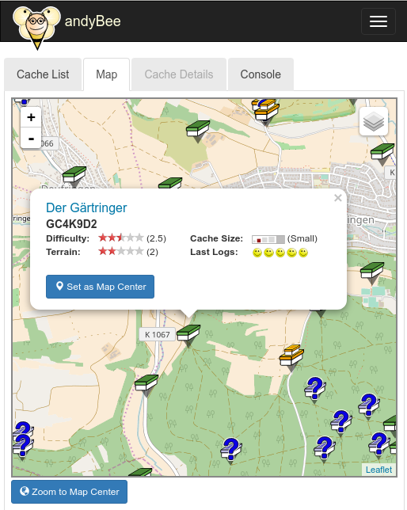
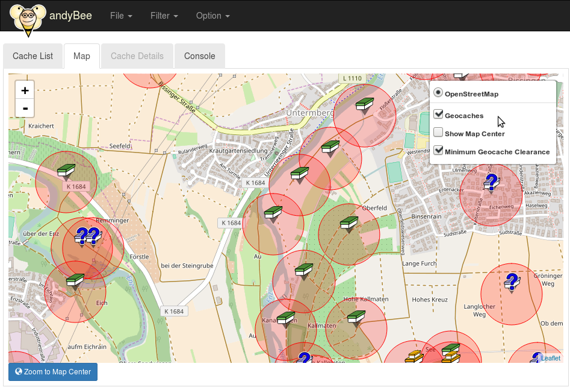
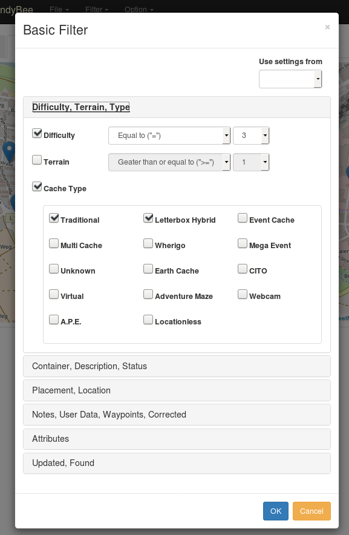
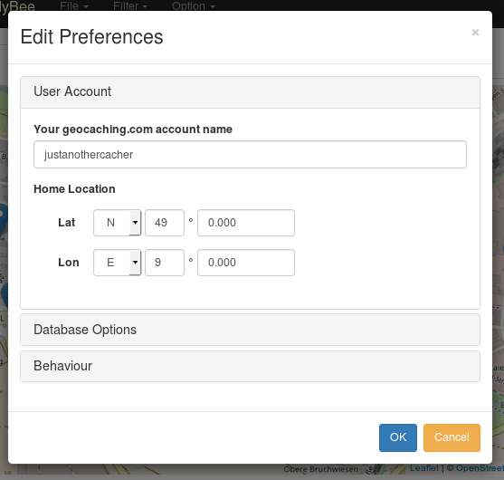
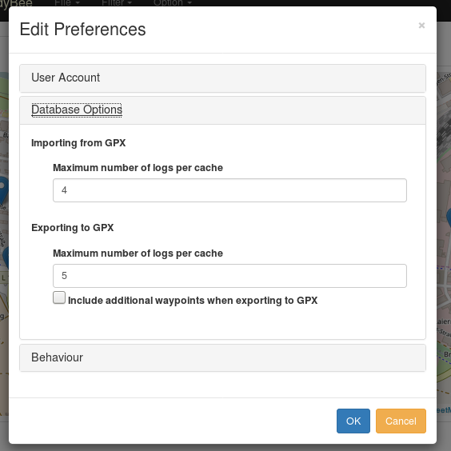

# Screenshots
This site provides a collection of some screenshots

## List of geocaches
> 

## Geocache details
> 

## Geocache description
> 

## Geocache logs
> 

## Map

On the following screenshot the blue circle indicates the current center of the map.

Additionally the screenshot shows the clustering feature. Instead of flooding the map with
geocache markers, multiple markers are clustered and represented by circles with
the number of geocaches in the center. When zooming in (or out), the clusters are expanded as required.

Hovering over a cluster shows the polygon of the area covered by the cluster.

A click on a cluster zooms in into the corresponding area.

> 

The following screenshot shows how a cluster is expanded when clicking on it. Additionally, the popup is shown when clicking on a geocache marker.
> 

The following screenshot shows the minimum distance clearance (161 meters) around each geocache on the map.
> 

# Filter
> 

# Preferences, account
> 

# Preferences, database options
> 
